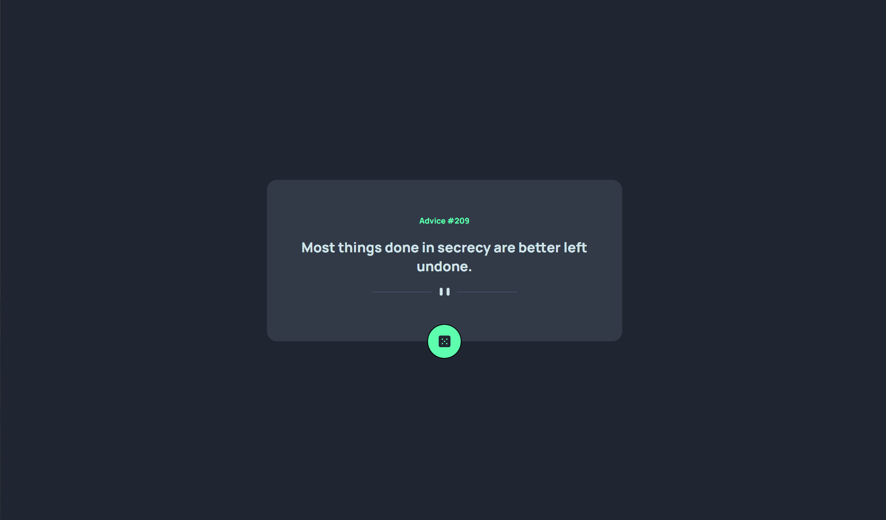
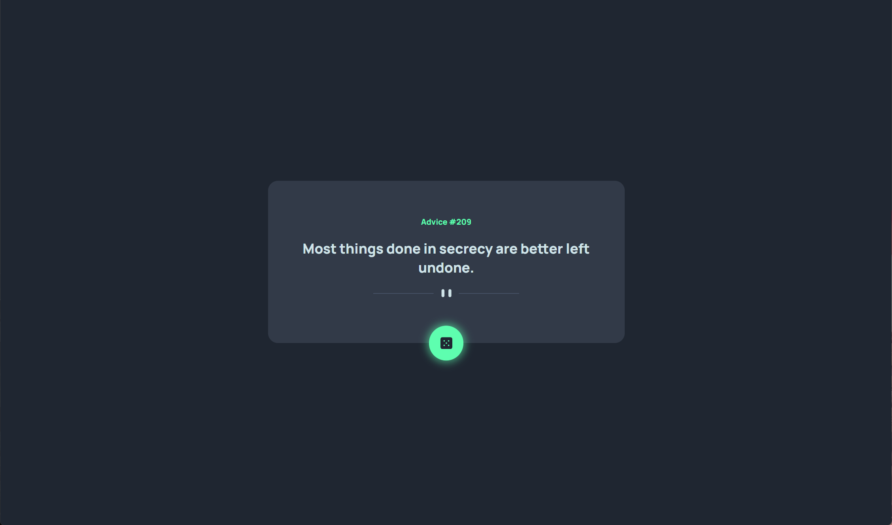
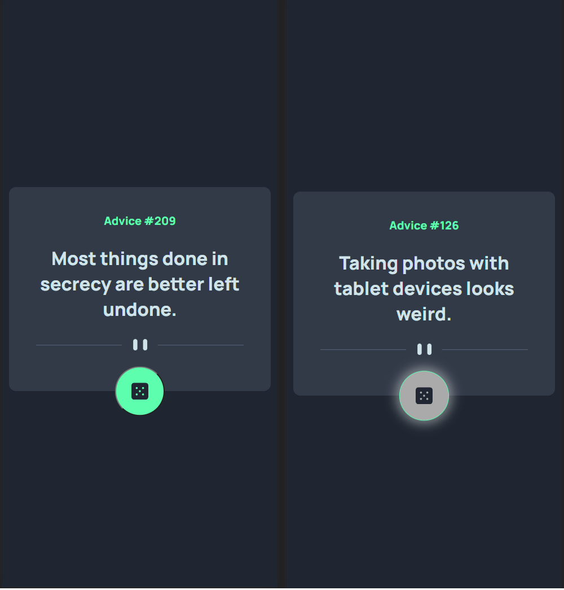

# Frontend Mentor - QR code component solution

This is a solution to the [QR code component challenge on Frontend Mentor](https://www.frontendmentor.io/challenges/qr-code-component-iux_sIO_H). Frontend Mentor challenges help you improve your coding skills by building realistic projects. 

## Table of contents

- [Overview](#overview)
  - [Screenshot](#screenshot)
  - [Links](#links)
- [My process](#my-process)
  - [Built with](#built-with)
  - [What I learned](#what-i-learned)
  - [Continued development](#continued-development)
- [Author](#author)
- [Acknowledgments](#acknowledgments)


## Overview

### Screenshot
- Desktop view



- Mobile View



### Links

- Solution URL: https://github.com/mrxshinji/FE-mentor-advice-generator
- Live Site URL: https://mrxshinji.github.io/FE-mentor-advice-generator/

## My process

### Built with

- Semantic HTML5 markup
- Flexbox
- CSS Grid
- Mobile-first workflow

### What I learned

Learned React. Trying to do a react app with the api with Hooks.

### Continued development

Handling of async/await or promise/then to fetch the data meanwhile browser loading

Commented part is another way to get the data and catch the error. Use async await version for cleaner scripts
```js
  const getAdvice = async () => {
    const res = await axios.get (api_url).catch(error => {setError(error)})
    setAdvice(res.data.slip)
    //   axios.get(api_url).then((res) => {
    //     const advices = res.data.slip
    //     setAdvice(advices)
    //   }).catch(err  => console.err("Error: " + err));
  }
```

### Useful resources

- [https://stackoverflow.com/] - Provide alot of insight on centering item.
- [https://www.w3schools.com/] - Provide alot help on syntax and how to use each method

## Author

- Website - [https://github.com/mrxshinji]
- Frontend Mentor - [@mrxshinji](https://www.frontendmentor.io/profile/mrxshinji)

## Acknowledgments

[useEffect with axios to fetch api data](https://levelup.gitconnected.com/fetch-api-data-with-axios-and-display-it-in-a-react-app-with-hooks-3f9c8fa89e7b)

